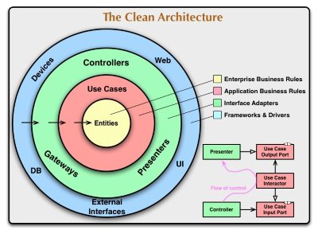

### 🔍 클린 아키텍처란?
클린 아키텍처(Clean Architecture)는 로버트 C. 마틴(Robert C. Martin, "Uncle Bob") 이 제안한 소프트웨어 아키텍처 원칙으로, 유지보수성과 확장성을 높이기 위한 구조적인 설계 방식입니다.
### 🏛️ 클린 아키텍처의 핵심 개념
클린 아키텍처는 계층화된 아키텍처(Layered Architecture)를 기반으로 하며, 각 계층이 명확한 역할을 가집니다.
### 🌀 아키텍처의 4가지 주요 계층
1. Entities (엔티티)
1. Use Cases (유스케이스)
1. Interface Adapters (인터페이스 어댑터)
1. Frameworks & Drivers (프레임워크 & 드라이버)
---
### 🎯 클린 아키텍처의 주요 원칙
1. 의존성 역전 원칙 (Dependency Rule)
1. 비즈니스 중심 설계
1. 테스트 용이성 (Testability)
